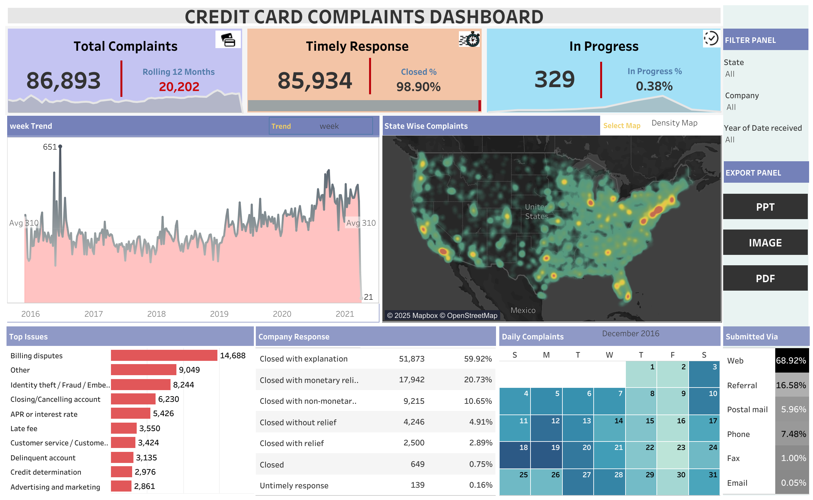

# 💳 Credit Card Complaints Analysis Dashboard

An interactive data analytics project analyzing **credit card complaints** to uncover
customer pain points, resolution efficiency, and complaint trends using **Tableau Public**.

---

## 📊 Live Interactive Dashboard
🔗 **View Dashboard (Tableau Public):**  
https://public.tableau.com/app/profile/aashi.umrao/viz/creditcardcomplaint_17656900883070/Dashboard1

---

## 📸 Dashboard Preview
> *This is a static image preview. Interactive filters such as date range, company,
> and complaint attributes are available in the live dashboard.*

---

## 🎯 Project Objective
To analyze customer complaints related to credit cards and identify:
- Major complaint issues
- Resolution performance
- Customer dissatisfaction patterns
- Geographic and temporal trends

---

## 📌 Key KPIs
- Total Credit Card Complaints
- % Complaints with Timely Response
- In-Progress Complaints
- Complaint Trends Over Time
- Complaint Submission Channels

---

## 📈 Dashboard Insights
- Monthly trend of credit card complaints
- State-wise complaint distribution
- Top complaint issues and categories
- Company response analysis
- Complaint submission channels (Web, Phone, Referral, etc.)
- Daily complaint pattern analysis

---

## 🛠 Tools & Technologies
- **Tableau Public** – Interactive dashboard & visualization
- **Python (Pandas)** – Data cleaning and preprocessing
- **CSV Dataset** – Consumer complaint records

---

## 📂 Dataset
**Consumer Financial Protection Bureau (CFPB) – Consumer Complaints Database**

🔗 Dataset source:  
https://www.consumerfinance.gov/data-research/consumer-complaints/

*(Large datasets are not included in this repository due to size constraints.)*

---

## 🚀 Deployment
- The dashboard is deployed on **Tableau Public**
- GitHub repository serves as documentation and project showcase

---

